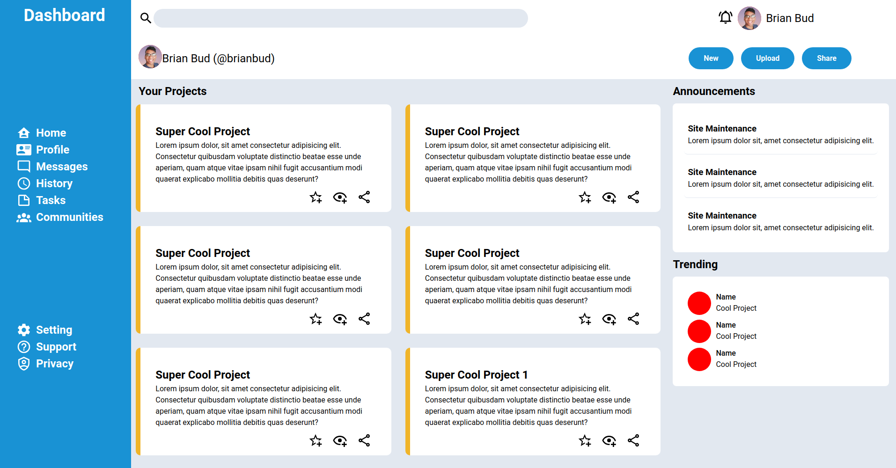

# Admin Dashboard

**Link to project**: https://brianbud.github.io/admin-dashboard/

## About Project

Dashboard Layout to practice Grid

**Tech used:** HTML, CSS

## Lessons Learnt

- how to create columns and rows with grid
- when to use grid and flexbox
- how to use the repeat() and minmax() method with grid property
- how to change svg fill color
